# WChess — System Diagrams

> Companion to `report.md`. Every diagram is grounded in the actual codebase
> (real Redis keys, real timings, real guards). Rendered with Mermaid — views
> natively on GitHub, VS Code (Mermaid extension), and https://mermaid.live.
>
> **Color legend used throughout:**
> 🔵 Blue = Client/Browser · 🟠 Amber = NestJS Server · 🔴 Red = Redis ·
> 🟣 Indigo = PostgreSQL · 🟢 Green = External/Third-party · ⚫ Grey = Deferred/Future

---

## Index

| # | Diagram | Level |
|---|---------|-------|
| 1 | System Context (who talks to the system) | HLD — L1 |
| 2 | Container Diagram (deployables + datastores) | HLD — L2 |
| 3 | Backend Module/Component Map | HLD — L3 |
| 4 | Auth — Register/Login Flowchart | Flow |
| 5 | Auth — Refresh Token Rotation (sequence) | Flow |
| 6 | Matchmaking — Quick Match Master Flow + Sub-flows | Flow |
| 7 | Matchmaking — Pairing Poll Loop (low level) | LLD |
| 8 | Friend Challenge — Lifecycle + Double-Accept Race | Flow + LLD |
| 9 | vs-Computer — Stockfish WASM Round Trip (sequence) | Flow |
| 10 | Live Move — Server Validation Ladder | LLD |
| 11 | Game Room — State Machine | LLD |
| 12 | Disconnect / Reconnect — Grace Period Flow | Flow |
| 13 | Game End — Rating Pipeline (Glicko-2) | LLD |
| 14 | ER Diagram — PostgreSQL | Data |
| 15 | Redis Keyspace Map | Data |
| 16 | Deployment — Today (Stage 1) vs. Architecture B | HLD |

---

## 1 · System Context — Outside the System (C4 Level 1)

Everything that exists *outside* WChess and how it touches the system boundary.

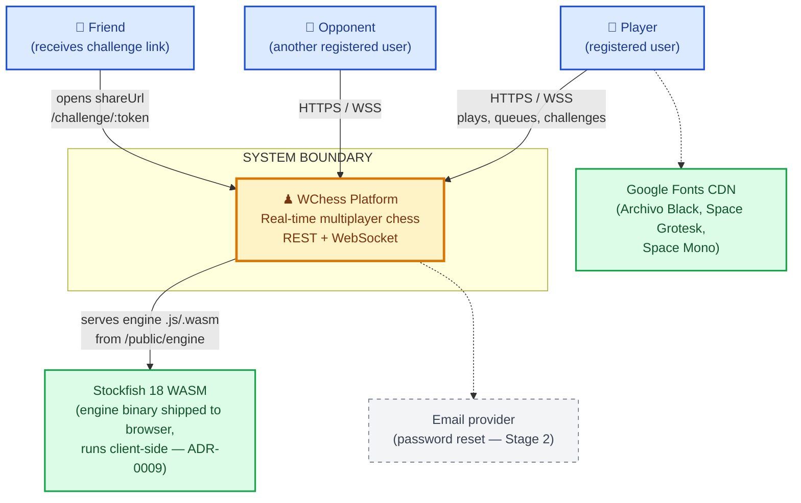
```mermaid
flowchart TB
    classDef person fill:#dbeafe,stroke:#1d4ed8,stroke-width:2px,color:#1e3a8a
    classDef system fill:#fef3c7,stroke:#d97706,stroke-width:3px,color:#78350f
    classDef ext fill:#dcfce7,stroke:#16a34a,stroke-width:2px,color:#14532d
    classDef future fill:#f3f4f6,stroke:#6b7280,stroke-dasharray:5 5,color:#374151

    P1["👤 Player<br/>(registered user)"]:::person
    P2["👤 Opponent<br/>(another registered user)"]:::person
    P3["👤 Friend<br/>(receives challenge link)"]:::person

    subgraph BOUNDARY["  SYSTEM BOUNDARY  "]
        W["♟ WChess Platform<br/>Real-time multiplayer chess<br/>REST + WebSocket"]:::system
    end

    SF["Stockfish 18 WASM<br/>(engine binary shipped to browser,<br/>runs client-side — ADR-0009)"]:::ext
    GF["Google Fonts CDN<br/>(Archivo Black, Space Grotesk,<br/>Space Mono)"]:::ext
    MAIL["Email provider<br/>(password reset — Stage 2)"]:::future

    P1 -- "HTTPS / WSS<br/>plays, queues, challenges" --> W
    P2 -- "HTTPS / WSS" --> W
    P3 -- "opens shareUrl<br/>/challenge/:token" --> W
    W -- "serves engine .js/.wasm<br/>from /public/engine" --> SF
    P1 -.-> GF
    W -.-> MAIL
```

---

## 2 · Container Diagram — Inside the System (C4 Level 2)

The deployable units and datastores, exactly as `docker-compose.yml` + the two apps define them.

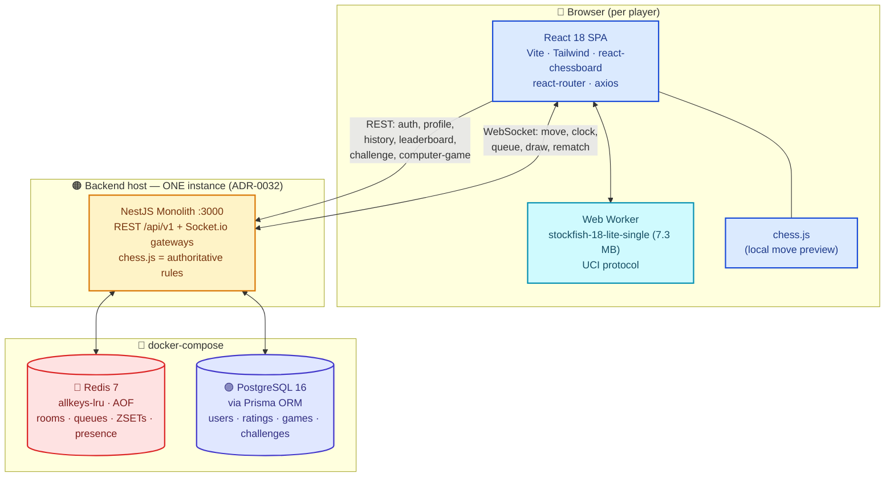
```mermaid
flowchart TB
    classDef client fill:#dbeafe,stroke:#1d4ed8,stroke-width:2px,color:#1e3a8a
    classDef server fill:#fef3c7,stroke:#d97706,stroke-width:2px,color:#78350f
    classDef redis fill:#fee2e2,stroke:#dc2626,stroke-width:2px,color:#7f1d1d
    classDef pg fill:#e0e7ff,stroke:#4338ca,stroke-width:2px,color:#312e81
    classDef worker fill:#cffafe,stroke:#0891b2,stroke-width:2px,color:#164e63

    subgraph BROWSER["🔵 Browser (per player)"]
        SPA["React 18 SPA<br/>Vite · Tailwind · react-chessboard<br/>react-router · axios"]:::client
        WW["Web Worker<br/>stockfish-18-lite-single (7.3 MB)<br/>UCI protocol"]:::worker
        CJ1["chess.js<br/>(local move preview)"]:::client
        SPA <--> WW
        SPA --- CJ1
    end

    subgraph HOST["🟠 Backend host — ONE instance (ADR-0032)"]
        API["NestJS Monolith :3000<br/>REST /api/v1 + Socket.io gateways<br/>chess.js = authoritative rules"]:::server
    end

    subgraph DOCKER["🐳 docker-compose"]
        R[("🔴 Redis 7<br/>allkeys-lru · AOF<br/>rooms · queues · ZSETs · presence")]:::redis
        PG[("🟣 PostgreSQL 16<br/>via Prisma ORM<br/>users · ratings · games · challenges")]:::pg
    end

    SPA -- "REST: auth, profile,<br/>history, leaderboard,<br/>challenge, computer-game" --> API
    SPA <-- "WebSocket: move, clock,<br/>queue, draw, rematch" --> API
    API <--> R
    API <--> PG
```

---

## 3 · Backend Module Map (C4 Level 3)

The six v1 modules and the only two cross-module dependencies that exist (the audit behind ADR-0032).

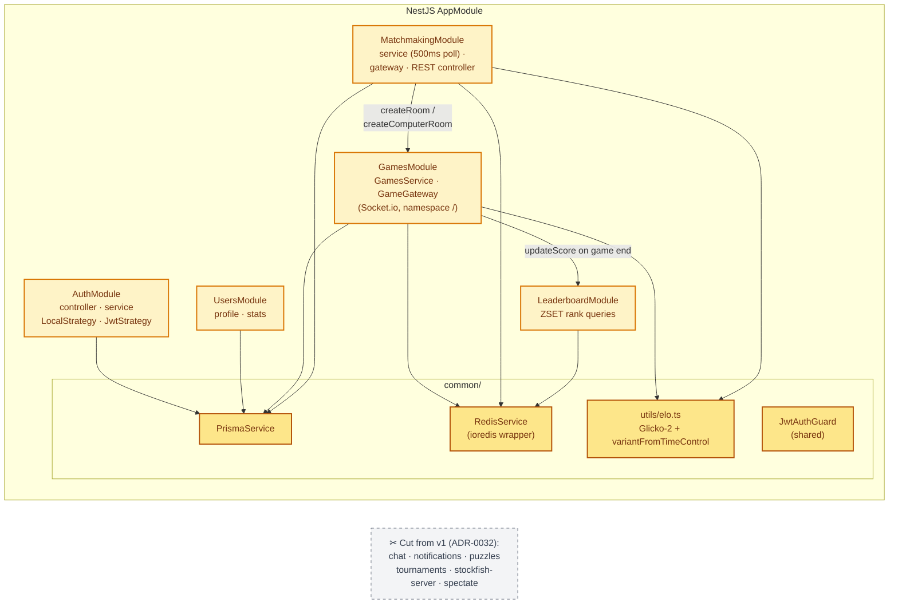
```mermaid
flowchart LR
    classDef mod fill:#fef3c7,stroke:#d97706,stroke-width:2px,color:#78350f
    classDef common fill:#fde68a,stroke:#b45309,stroke-width:2px,color:#78350f
    classDef redis fill:#fee2e2,stroke:#dc2626,stroke-width:2px,color:#7f1d1d
    classDef pg fill:#e0e7ff,stroke:#4338ca,stroke-width:2px,color:#312e81
    classDef cut fill:#f3f4f6,stroke:#6b7280,stroke-dasharray:5 5,color:#374151

    subgraph APP["NestJS AppModule"]
        AUTH["AuthModule<br/>controller · service<br/>LocalStrategy · JwtStrategy"]:::mod
        USERS["UsersModule<br/>profile · stats"]:::mod
        GAMES["GamesModule<br/>GamesService · GameGateway<br/>(Socket.io, namespace /)"]:::mod
        MM["MatchmakingModule<br/>service (500ms poll) ·<br/>gateway · REST controller"]:::mod
        LB["LeaderboardModule<br/>ZSET rank queries"]:::mod

        subgraph COMMON["common/"]
            PRISMA["PrismaService"]:::common
            REDISSVC["RedisService<br/>(ioredis wrapper)"]:::common
            ELO["utils/elo.ts<br/>Glicko-2 + variantFromTimeControl"]:::common
            GUARD["JwtAuthGuard<br/>(shared)"]:::common
        end
    end

    CUT["✂ Cut from v1 (ADR-0032):<br/>chat · notifications · puzzles<br/>tournaments · stockfish-server · spectate"]:::cut

    MM -- "createRoom /<br/>createComputerRoom" --> GAMES
    GAMES -- "updateScore on game end" --> LB
    AUTH --> PRISMA
    USERS --> PRISMA
    GAMES --> PRISMA & REDISSVC & ELO
    MM --> PRISMA & REDISSVC & ELO
    LB --> REDISSVC
```

**The two arrows between modules (`MM→GAMES`, `GAMES→LB`) are the entire coupling graph** — the measured fact that justified staying a monolith.

---

## 4 · Auth — Register & Login Flow

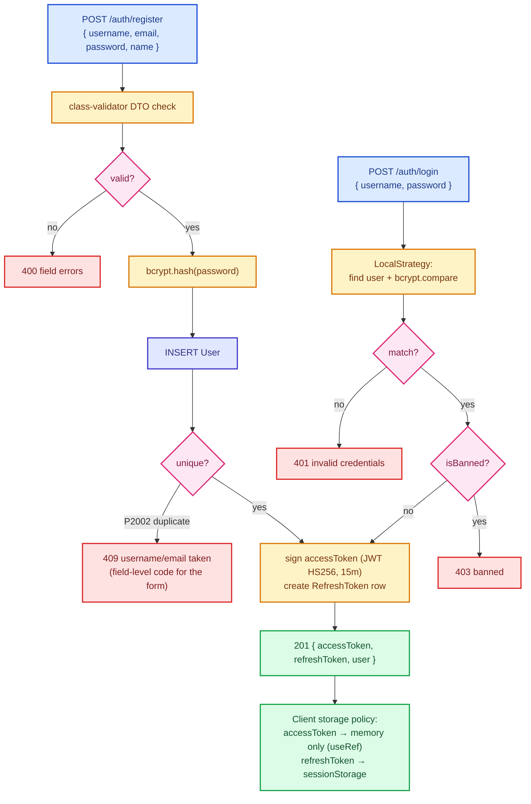
```mermaid
flowchart TD
    classDef start fill:#dbeafe,stroke:#1d4ed8,stroke-width:2px,color:#1e3a8a
    classDef proc fill:#fef3c7,stroke:#d97706,stroke-width:2px,color:#78350f
    classDef dec fill:#fce7f3,stroke:#db2777,stroke-width:2px,color:#831843
    classDef ok fill:#dcfce7,stroke:#16a34a,stroke-width:2px,color:#14532d
    classDef err fill:#fee2e2,stroke:#dc2626,stroke-width:2px,color:#7f1d1d
    classDef pg fill:#e0e7ff,stroke:#4338ca,stroke-width:2px,color:#312e81

    A["POST /auth/register<br/>{ username, email, password, name }"]:::start --> B["class-validator DTO check"]:::proc
    B --> C{"valid?"}:::dec
    C -- no --> E1["400 field errors"]:::err
    C -- yes --> D["bcrypt.hash(password)"]:::proc
    D --> F["INSERT User"]:::pg
    F --> G{"unique?"}:::dec
    G -- "P2002 duplicate" --> E2["409 username/email taken<br/>(field-level code for the form)"]:::err
    G -- yes --> H["sign accessToken (JWT HS256, 15m)<br/>create RefreshToken row"]:::proc
    H --> I["201 { accessToken, refreshToken, user }"]:::ok

    L["POST /auth/login<br/>{ username, password }"]:::start --> M["LocalStrategy:<br/>find user + bcrypt.compare"]:::proc
    M --> N{"match?"}:::dec
    N -- no --> E3["401 invalid credentials"]:::err
    N -- yes --> O{"isBanned?"}:::dec
    O -- yes --> E4["403 banned"]:::err
    O -- no --> H

    I --> S["Client storage policy:<br/>accessToken → memory only (useRef)<br/>refreshToken → sessionStorage"]:::ok
```

---

## 5 · Auth — Silent Refresh with Token Rotation

The interceptor-queue pattern: concurrent 401s trigger **one** refresh, everyone else waits.

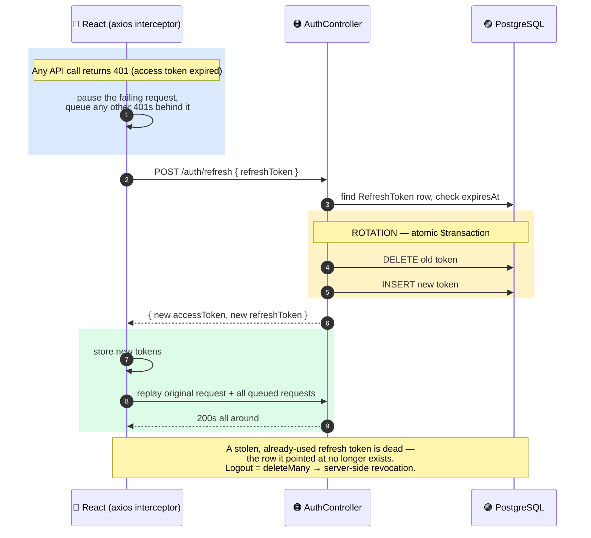
```mermaid
sequenceDiagram
    autonumber
    participant C as 🔵 React (axios interceptor)
    participant A as 🟠 AuthController
    participant DB as 🟣 PostgreSQL

    rect rgb(219, 234, 254)
        note over C: Any API call returns 401 (access token expired)
        C->>C: pause the failing request,<br/>queue any other 401s behind it
    end

    C->>A: POST /auth/refresh { refreshToken }
    A->>DB: find RefreshToken row, check expiresAt

    rect rgb(254, 243, 199)
        note over A,DB: ROTATION — atomic $transaction
        A->>DB: DELETE old token
        A->>DB: INSERT new token
    end

    A-->>C: { new accessToken, new refreshToken }

    rect rgb(220, 252, 231)
        C->>C: store new tokens
        C->>A: replay original request + all queued requests
        A-->>C: 200s all around
    end

    note over C,DB: A stolen, already-used refresh token is dead —<br/>the row it pointed at no longer exists.<br/>Logout = deleteMany → server-side revocation.
```

---

## 6 · Matchmaking — Quick Match Master Flow

High-level flow with the two server-owned background loops as sub-flows.

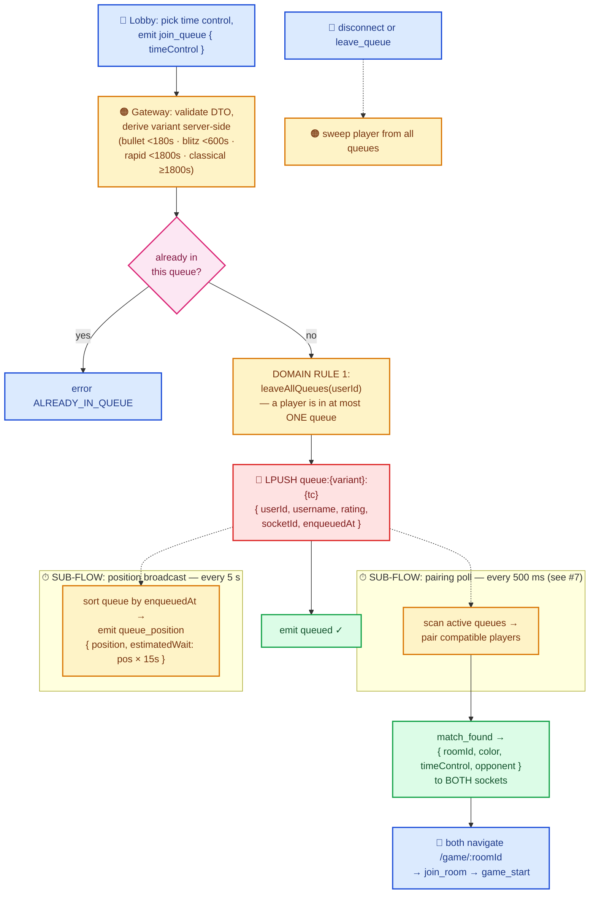
```mermaid
flowchart TD
    classDef client fill:#dbeafe,stroke:#1d4ed8,stroke-width:2px,color:#1e3a8a
    classDef server fill:#fef3c7,stroke:#d97706,stroke-width:2px,color:#78350f
    classDef redis fill:#fee2e2,stroke:#dc2626,stroke-width:2px,color:#7f1d1d
    classDef dec fill:#fce7f3,stroke:#db2777,stroke-width:2px,color:#831843
    classDef ok fill:#dcfce7,stroke:#16a34a,stroke-width:2px,color:#14532d

    A["🔵 Lobby: pick time control,<br/>emit join_queue { timeControl }"]:::client --> B["🟠 Gateway: validate DTO,<br/>derive variant server-side<br/>(bullet <180s · blitz <600s ·<br/>rapid <1800s · classical ≥1800s)"]:::server
    B --> C{"already in<br/>this queue?"}:::dec
    C -- yes --> C1["error ALREADY_IN_QUEUE"]:::client
    C -- no --> D["DOMAIN RULE 1:<br/>leaveAllQueues(userId)<br/>— a player is in at most ONE queue"]:::server
    D --> E["🔴 LPUSH queue:{variant}:{tc}<br/>{ userId, username, rating,<br/>socketId, enqueuedAt }"]:::redis
    E --> F["emit queued ✓"]:::ok

    subgraph LOOP1["⏱ SUB-FLOW: pairing poll — every 500 ms (see #7)"]
        G["scan active queues →<br/>pair compatible players"]:::server
    end

    subgraph LOOP2["⏱ SUB-FLOW: position broadcast — every 5 s"]
        H["sort queue by enqueuedAt →<br/>emit queue_position<br/>{ position, estimatedWait: pos × 15s }"]:::server
    end

    E -.-> G
    E -.-> H
    G --> I["match_found →<br/>{ roomId, color, timeControl, opponent }<br/>to BOTH sockets"]:::ok
    I --> J["🔵 both navigate /game/:roomId<br/>→ join_room → game_start"]:::client

    K["🔵 disconnect or leave_queue"]:::client -.-> L["🟠 sweep player from all queues"]:::server
```

---

## 7 · Matchmaking — Pairing Poll Loop (Low Level)

The exact algorithm inside `MatchmakingService.poll()`, including the ADR-0008 tolerance curve and the LREM claim-with-putback.

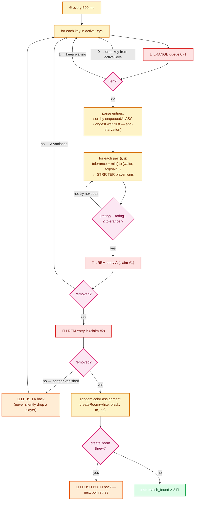
```mermaid
flowchart TD
    classDef proc fill:#fef3c7,stroke:#d97706,stroke-width:2px,color:#78350f
    classDef dec fill:#fce7f3,stroke:#db2777,stroke-width:2px,color:#831843
    classDef redis fill:#fee2e2,stroke:#dc2626,stroke-width:2px,color:#7f1d1d
    classDef ok fill:#dcfce7,stroke:#16a34a,stroke-width:2px,color:#14532d
    classDef warn fill:#ffedd5,stroke:#ea580c,stroke-width:2px,color:#7c2d12

    T["⏱ every 500 ms"]:::proc --> A["for each key in activeKeys"]:::proc
    A --> B["🔴 LRANGE queue 0 -1"]:::redis
    B --> C{"len?"}:::dec
    C -- "0 → drop key from activeKeys" --> A
    C -- "1 → keep waiting" --> A
    C -- "≥2" --> D["parse entries,<br/>sort by enqueuedAt ASC<br/>(longest wait first — anti-starvation)"]:::proc
    D --> E["for each pair (i, j):<br/>tolerance = min( tol(waitᵢ), tol(waitⱼ) )<br/>← STRICTER player wins"]:::proc
    E --> F{"|ratingᵢ − ratingⱼ|<br/>≤ tolerance ?"}:::dec
    F -- no, try next pair --> E
    F -- yes --> G["🔴 LREM entry A (claim #1)"]:::redis
    G --> H{"removed?"}:::dec
    H -- "no — A vanished" --> A
    H -- yes --> I["🔴 LREM entry B (claim #2)"]:::redis
    I --> J{"removed?"}:::dec
    J -- "no — partner vanished" --> K["🔴 LPUSH A back<br/>(never silently drop a player)"]:::warn
    K --> A
    J -- yes --> L["random color assignment<br/>createRoom(white, black, tc, inc)"]:::proc
    L --> M{"createRoom<br/>threw?"}:::dec
    M -- yes --> N["🔴 LPUSH BOTH back —<br/>next poll retries"]:::warn
    M -- no --> O["emit match_found × 2 🎉"]:::ok
```

**Pseudocode — the tolerance curve (ADR-0008):**

```text
FUNCTION tolerance(waitMs):
    waitSec ← max(0, waitMs) / 1000
    RETURN min(50 + waitSec × 12, 400)

    # t=0s   → ±50    (fresh player: fair match only)
    # t=10s  → ±170
    # t=20s  → ±290
    # t≥29s  → ±400   (cap: latency finally beats fairness)

PAIRING RULE:
    effective ← min(tolerance(waitA), tolerance(waitB))
    # a fresh player can never be dragged into an unfair match
    # by an opponent who has waited long enough to accept anyone
```

---

## 8 · Friend Challenge — Lifecycle & the Double-Accept Race

### 8a — Challenge state machine

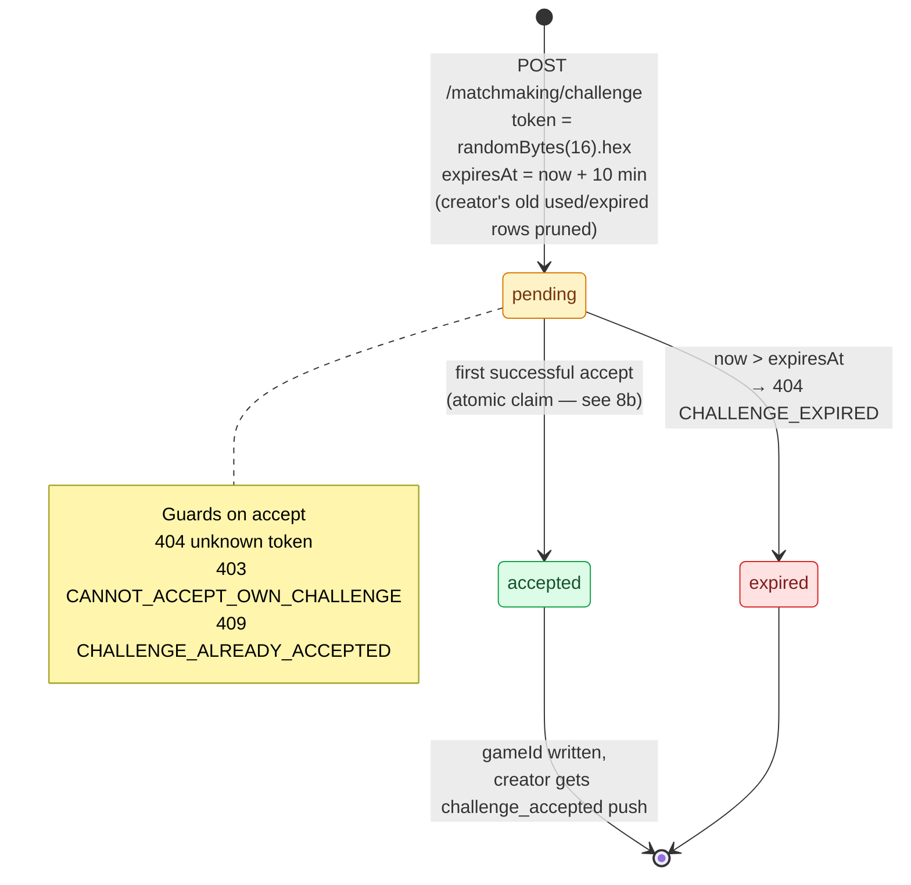
```mermaid
stateDiagram-v2
    classDef pend fill:#fef3c7,stroke:#d97706,color:#78350f
    classDef acc fill:#dcfce7,stroke:#16a34a,color:#14532d
    classDef exp fill:#fee2e2,stroke:#dc2626,color:#7f1d1d

    [*] --> pending : POST /matchmaking/challenge<br/>token = randomBytes(16).hex<br/>expiresAt = now + 10 min<br/>(creator's old used/expired rows pruned)
    pending --> accepted : first successful accept<br/>(atomic claim — see 8b)
    pending --> expired : now > expiresAt<br/>→ 404 CHALLENGE_EXPIRED
    accepted --> [*] : gameId written,<br/>creator gets challenge_accepted push
    expired --> [*]

    class pending pend
    class accepted acc
    class expired exp

    note right of pending
        Guards on accept
        404 unknown token
        403 CANNOT_ACCEPT_OWN_CHALLENGE
        409 CHALLENGE_ALREADY_ACCEPTED
    end note
```

### 8b — The TOCTOU race, closed (verified live: exactly one 201 + one 409)

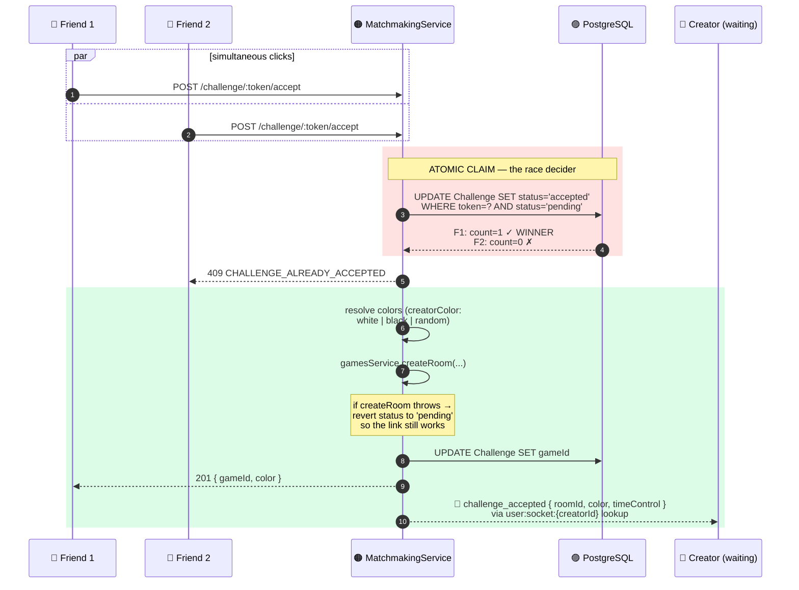
```mermaid
sequenceDiagram
    autonumber
    participant F1 as 🔵 Friend 1
    participant F2 as 🔵 Friend 2
    participant S as 🟠 MatchmakingService
    participant PG as 🟣 PostgreSQL
    participant CR as 🔵 Creator (waiting)

    par simultaneous clicks
        F1->>S: POST /challenge/:token/accept
    and
        F2->>S: POST /challenge/:token/accept
    end

    rect rgb(254, 226, 226)
        note over S,PG: ATOMIC CLAIM — the race decider
        S->>PG: UPDATE Challenge SET status='accepted'<br/>WHERE token=? AND status='pending'
        PG-->>S: F1: count=1 ✓ WINNER<br/>F2: count=0 ✗
    end

    S-->>F2: 409 CHALLENGE_ALREADY_ACCEPTED

    rect rgb(220, 252, 231)
        S->>S: resolve colors (creatorColor:<br/>white | black | random)
        S->>S: gamesService.createRoom(...)
        note over S: if createRoom throws →<br/>revert status to 'pending'<br/>so the link still works
        S->>PG: UPDATE Challenge SET gameId
        S-->>F1: 201 { gameId, color }
        S-->>CR: 🔔 challenge_accepted { roomId, color, timeControl }<br/>via user:socket:{creatorId} lookup
    end
```

---

## 9 · vs-Computer — Stockfish WASM Round Trip (ADR-0009)

The engine runs in the **human's own browser**; the server re-validates but never computes.

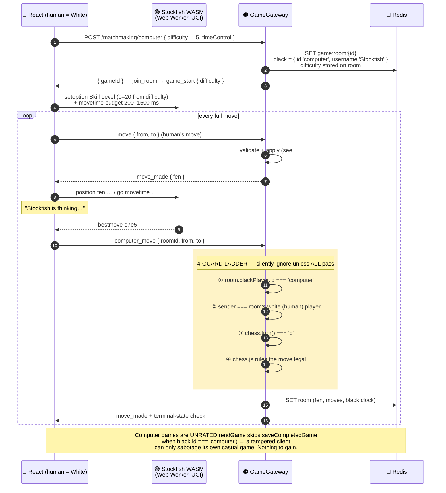
```mermaid
sequenceDiagram
    autonumber
    participant U as 🔵 React (human = White)
    participant SF as 🟢 Stockfish WASM<br/>(Web Worker, UCI)
    participant G as 🟠 GameGateway
    participant R as 🔴 Redis

    U->>G: POST /matchmaking/computer { difficulty 1–5, timeControl }
    G->>R: SET game:room:{id}<br/>black = { id:'computer', username:'Stockfish' }<br/>difficulty stored on room
    G-->>U: { gameId } → join_room → game_start { difficulty }

    U->>SF: setoption Skill Level (0–20 from difficulty)<br/>+ movetime budget 200–1500 ms

    loop every full move
        U->>G: move { from, to } (human's move)
        G->>G: validate + apply (see #10)
        G-->>U: move_made { fen }
        U->>SF: position fen … / go movetime …
        note over U: "Stockfish is thinking…"
        SF-->>U: bestmove e7e5
        U->>G: computer_move { roomId, from, to }

        rect rgb(254, 243, 199)
            note over G: 4-GUARD LADDER — silently ignore unless ALL pass
            G->>G: ① room.blackPlayer.id === 'computer'
            G->>G: ② sender === room's white (human) player
            G->>G: ③ chess.turn() === 'b'
            G->>G: ④ chess.js rules the move legal
        end

        G->>R: SET room (fen, moves, black clock)
        G-->>U: move_made + terminal-state check
    end

    note over U,R: Computer games are UNRATED (endGame skips saveCompletedGame<br/>when black.id === 'computer') → a tampered client<br/>can only sabotage its own casual game. Nothing to gain.
```

---

## 10 · Live Move — Server Validation Ladder (Low Level)

Every `move` event walks this exact ladder in `GameGateway.handleMove`.

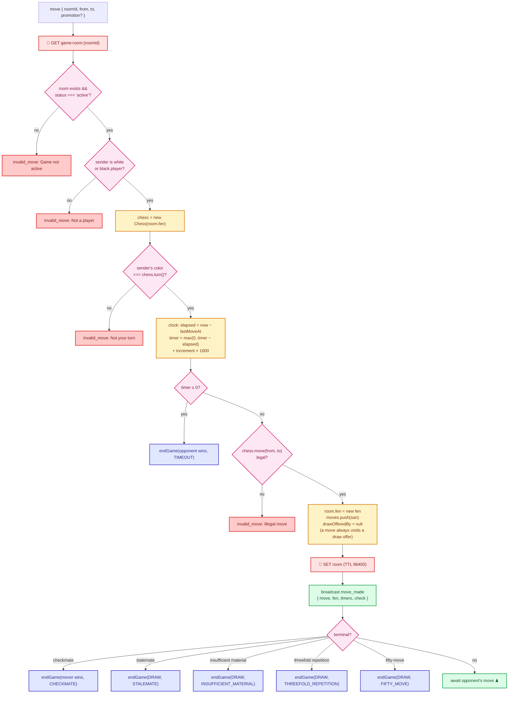
```mermaid
flowchart TD
    classDef proc fill:#fef3c7,stroke:#d97706,stroke-width:2px,color:#78350f
    classDef dec fill:#fce7f3,stroke:#db2777,stroke-width:2px,color:#831843
    classDef redis fill:#fee2e2,stroke:#dc2626,stroke-width:2px,color:#7f1d1d
    classDef err fill:#fecaca,stroke:#dc2626,stroke-width:2px,color:#7f1d1d
    classDef ok fill:#dcfce7,stroke:#16a34a,stroke-width:2px,color:#14532d
    classDef endg fill:#e0e7ff,stroke:#4338ca,stroke-width:2px,color:#312e81

    A["move { roomId, from, to, promotion? }"] --> B["🔴 GET game:room:{roomId}"]:::redis
    B --> C{"room exists &&<br/>status === 'active'?"}:::dec
    C -- no --> X1["invalid_move: Game not active"]:::err
    C -- yes --> D{"sender is white<br/>or black player?"}:::dec
    D -- no --> X2["invalid_move: Not a player"]:::err
    D -- yes --> E["chess = new Chess(room.fen)"]:::proc
    E --> F{"sender's color<br/>=== chess.turn()?"}:::dec
    F -- no --> X3["invalid_move: Not your turn"]:::err
    F -- yes --> G["clock: elapsed = now − lastMoveAt<br/>timer = max(0, timer − elapsed)<br/>+ increment × 1000"]:::proc
    G --> H{"timer ≤ 0?"}:::dec
    H -- yes --> Z1["endGame(opponent wins, TIMEOUT)"]:::endg
    H -- no --> I{"chess.move(from, to)<br/>legal?"}:::dec
    I -- no --> X4["invalid_move: Illegal move"]:::err
    I -- yes --> J["room.fen = new fen<br/>moves.push(san)<br/>drawOfferedBy = null<br/>(a move always voids a draw offer)"]:::proc
    J --> K["🔴 SET room (TTL 86400)"]:::redis
    K --> L["broadcast move_made<br/>{ move, fen, timers, check }"]:::ok
    L --> M{"terminal?"}:::dec
    M -- checkmate --> Z2["endGame(mover wins, CHECKMATE)"]:::endg
    M -- stalemate --> Z3["endGame(DRAW, STALEMATE)"]:::endg
    M -- "insufficient material" --> Z4["endGame(DRAW,<br/>INSUFFICIENT_MATERIAL)"]:::endg
    M -- "threefold repetition" --> Z5["endGame(DRAW,<br/>THREEFOLD_REPETITION)"]:::endg
    M -- "fifty-move" --> Z6["endGame(DRAW, FIFTY_MOVE)"]:::endg
    M -- no --> N["await opponent's move ♟"]:::ok
```

---

## 11 · Game Room — State Machine

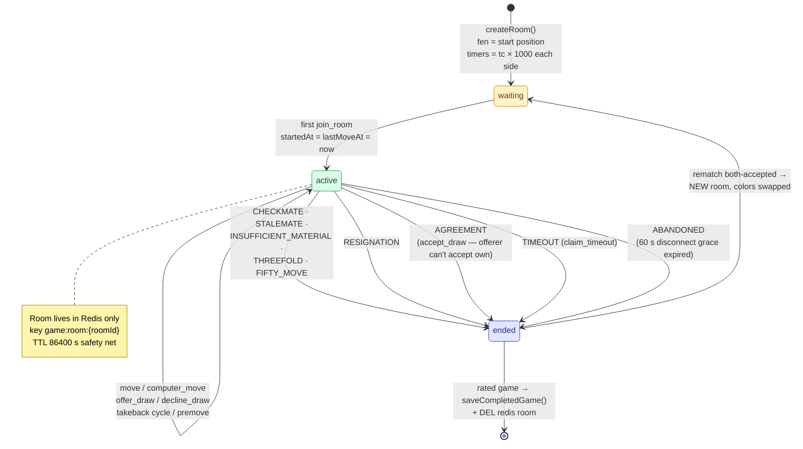
```mermaid
stateDiagram-v2
    classDef wait fill:#fef3c7,stroke:#d97706,color:#78350f
    classDef act fill:#dcfce7,stroke:#16a34a,color:#14532d
    classDef done fill:#e0e7ff,stroke:#4338ca,color:#312e81

    [*] --> waiting : createRoom()<br/>fen = start position<br/>timers = tc × 1000 each side

    waiting --> active : first join_room<br/>startedAt = lastMoveAt = now

    active --> active : move / computer_move<br/>offer_draw / decline_draw<br/>takeback cycle / premove

    active --> ended : CHECKMATE · STALEMATE ·<br/>INSUFFICIENT_MATERIAL ·<br/>THREEFOLD · FIFTY_MOVE
    active --> ended : RESIGNATION
    active --> ended : AGREEMENT<br/>(accept_draw — offerer can't accept own)
    active --> ended : TIMEOUT (claim_timeout)
    active --> ended : ABANDONED<br/>(60 s disconnect grace expired)

    ended --> [*] : rated game → saveCompletedGame()<br/>+ DEL redis room
    ended --> waiting : rematch both-accepted →<br/>NEW room, colors swapped

    class waiting wait
    class active act
    class ended done

    note right of active
        Room lives in Redis only
        key game:room:{roomId}
        TTL 86400 s safety net
    end note
```

---

## 12 · Disconnect / Reconnect — Grace Period Flow

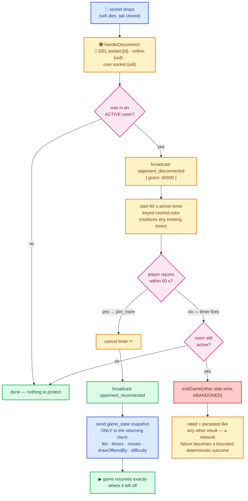
```mermaid
flowchart TD
    classDef client fill:#dbeafe,stroke:#1d4ed8,stroke-width:2px,color:#1e3a8a
    classDef server fill:#fef3c7,stroke:#d97706,stroke-width:2px,color:#78350f
    classDef redis fill:#fee2e2,stroke:#dc2626,stroke-width:2px,color:#7f1d1d
    classDef dec fill:#fce7f3,stroke:#db2777,stroke-width:2px,color:#831843
    classDef ok fill:#dcfce7,stroke:#16a34a,stroke-width:2px,color:#14532d
    classDef bad fill:#fecaca,stroke:#dc2626,stroke-width:2px,color:#7f1d1d

    A["🔵 socket drops<br/>(wifi dies, tab closed)"]:::client --> B["🟠 handleDisconnect:<br/>🔴 DEL socket:{id} · online:{uid} ·<br/>user:socket:{uid}"]:::server
    B --> C{"was in an<br/>ACTIVE room?"}:::dec
    C -- no --> C1["done — nothing to protect"]:::ok
    C -- yes --> D["broadcast opponent_disconnected<br/>{ grace: 60000 }"]:::server
    D --> E["start 60 s server timer<br/>keyed roomId:color<br/>(replaces any existing timer)"]:::server

    E --> F{"player rejoins<br/>within 60 s?"}:::dec

    F -- "yes → join_room" --> G["cancel timer ✂"]:::server
    G --> H["broadcast opponent_reconnected"]:::ok
    H --> I["send game_state snapshot<br/>ONLY to the returning client:<br/>fen · timers · moves ·<br/>drawOfferedBy · difficulty"]:::client
    I --> J["▶ game resumes exactly<br/>where it left off"]:::ok

    F -- "no — timer fires" --> K{"room still<br/>active?"}:::dec
    K -- no --> C1
    K -- yes --> L["endGame(other side wins,<br/>ABANDONED)"]:::bad
    L --> M["rated + persisted like<br/>any other result — a network<br/>failure becomes a bounded,<br/>deterministic outcome"]:::server
```

---

## 13 · Game End — Glicko-2 Rating Pipeline

What happens inside `endGame → saveCompletedGame` for a rated (human vs human) game.

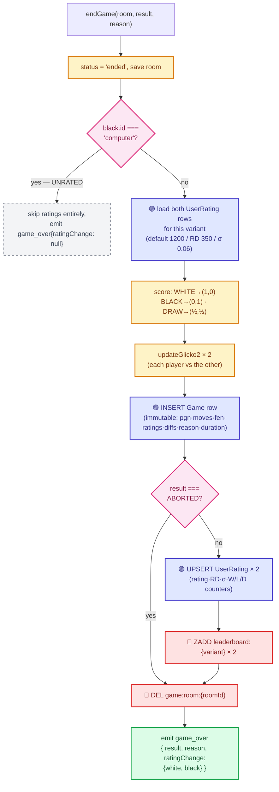
```mermaid
flowchart TD
    classDef proc fill:#fef3c7,stroke:#d97706,stroke-width:2px,color:#78350f
    classDef dec fill:#fce7f3,stroke:#db2777,stroke-width:2px,color:#831843
    classDef pg fill:#e0e7ff,stroke:#4338ca,stroke-width:2px,color:#312e81
    classDef redis fill:#fee2e2,stroke:#dc2626,stroke-width:2px,color:#7f1d1d
    classDef ok fill:#dcfce7,stroke:#16a34a,stroke-width:2px,color:#14532d
    classDef skip fill:#f3f4f6,stroke:#6b7280,stroke-dasharray:5 5,color:#374151

    A["endGame(room, result, reason)"] --> B["status = 'ended', save room"]:::proc
    B --> C{"black.id ===<br/>'computer'?"}:::dec
    C -- "yes — UNRATED" --> C1["skip ratings entirely,<br/>emit game_over{ratingChange: null}"]:::skip
    C -- no --> D["🟣 load both UserRating rows<br/>for this variant<br/>(default 1200 / RD 350 / σ 0.06)"]:::pg
    D --> E["score: WHITE→(1,0)<br/>BLACK→(0,1) · DRAW→(½,½)"]:::proc
    E --> F["updateGlicko2 × 2<br/>(each player vs the other)"]:::proc
    F --> G["🟣 INSERT Game row<br/>(immutable: pgn·moves·fen·<br/>ratings·diffs·reason·duration)"]:::pg
    G --> H{"result ===<br/>ABORTED?"}:::dec
    H -- yes --> K
    H -- no --> I["🟣 UPSERT UserRating × 2<br/>(rating·RD·σ·W/L/D counters)"]:::pg
    I --> J["🔴 ZADD leaderboard:{variant} × 2"]:::redis
    J --> K["🔴 DEL game:room:{roomId}"]:::redis
    K --> L["emit game_over<br/>{ result, reason, ratingChange:<br/>{white, black} }"]:::ok
```

**Pseudocode — one Glicko-2 update (`common/utils/elo.ts`):**

```text
FUNCTION updateGlicko2(player{r, RD, σ}, opponent{r, RD}, score ∈ {0, ½, 1}):
    # 1. convert to internal scale
    μ  ← (r − 1500) / 173.7178          φ  ← RD / 173.7178
    μⱼ ← (opp.r − 1500) / 173.7178      φⱼ ← opp.RD / 173.7178

    # 2. expected outcome, discounted by opponent uncertainty
    g(φⱼ) ← 1 / √(1 + 3φⱼ²/π²)
    E     ← 1 / (1 + e^(−g(φⱼ)(μ − μⱼ)))

    # 3. estimated variance & improvement
    v ← 1 / (g² · E · (1−E))
    Δ ← v · g · (score − E)

    # 4. NEW VOLATILITY — root of f(x) via Illinois algorithm
    #    (regula falsi with halving; ≤100 iters, ε = 1e-6)
    σ′ ← solve f(x) = 0 near ln(σ²), τ = 0.5

    # 5. recombine
    φ* ← √(φ² + σ′²)                    # uncertainty grows with volatility
    φ′ ← 1 / √(1/φ*² + 1/v)            # …then shrinks with new evidence
    μ′ ← μ + φ′² · g · (score − E)

    # 6. back to display scale, RD clamped to [30, 350]
    RETURN { r′ = 1500 + 173.7178·μ′,  RD′ = clamp(173.7178·φ′),  σ′ }

# provisional flag in schema: RD > 110 → rating still "settling"
```

---

## 14 · ER Diagram — PostgreSQL (Prisma schema, as-is)

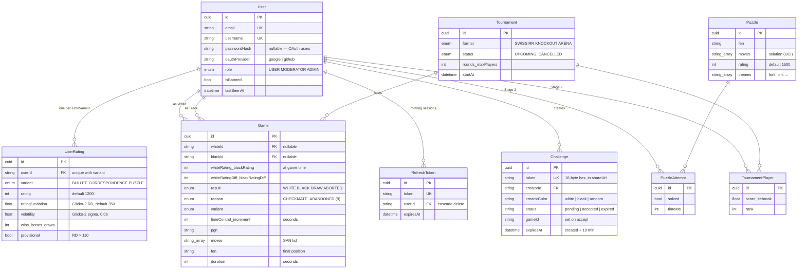
```mermaid
erDiagram
    User ||--o{ UserRating : "one per TimeVariant"
    User ||--o{ Game : "as White"
    User ||--o{ Game : "as Black"
    User ||--o{ RefreshToken : "rotating sessions"
    User ||--o{ Challenge : "creates"
    User ||--o{ PuzzleAttempt : "Stage 2"
    User ||--o{ TournamentPlayer : "Stage 2"
    Tournament ||--o{ TournamentPlayer : ""
    Tournament ||--o{ Game : "hosts"
    Puzzle ||--o{ PuzzleAttempt : ""

    User {
        cuid id PK
        string email UK
        string username UK
        string passwordHash "nullable — OAuth users"
        string oauthProvider "google | github"
        enum role "USER MODERATOR ADMIN"
        bool isBanned
        datetime lastSeenAt
    }
    UserRating {
        cuid id PK
        string userId FK "unique with variant"
        enum variant "BULLET..CORRESPONDENCE PUZZLE"
        int rating "default 1200"
        float ratingDeviation "Glicko-2 RD, default 350"
        float volatility "Glicko-2 sigma, 0.06"
        int wins_losses_draws
        bool provisional "RD > 110"
    }
    Game {
        cuid id PK
        string whiteId FK "nullable"
        string blackId FK "nullable"
        int whiteRating_blackRating "at game time"
        int whiteRatingDiff_blackRatingDiff
        enum result "WHITE BLACK DRAW ABORTED"
        enum reason "CHECKMATE..ABANDONED (9)"
        enum variant
        int timeControl_increment "seconds"
        string pgn
        string_array moves "SAN list"
        string fen "final position"
        int duration "seconds"
    }
    Challenge {
        uuid id PK
        string token UK "16-byte hex, in shareUrl"
        string creatorId FK
        string creatorColor "white | black | random"
        string status "pending | accepted | expired"
        string gameId "set on accept"
        datetime expiresAt "created + 10 min"
    }
    RefreshToken {
        cuid id PK
        string token UK
        string userId FK "cascade delete"
        datetime expiresAt
    }
    Tournament {
        cuid id PK
        enum format "SWISS RR KNOCKOUT ARENA"
        enum status "UPCOMING..CANCELLED"
        int rounds_maxPlayers
        datetime startAt
    }
    TournamentPlayer {
        cuid id PK
        float score_tiebreak
        int rank
    }
    Puzzle {
        cuid id PK
        string fen
        string_array moves "solution (UCI)"
        int rating "default 1500"
        string_array themes "fork, pin, ..."
    }
    PuzzleAttempt {
        cuid id PK
        bool solved
        int timeMs
    }
```

**Index strategy (matches real query shapes):**

| Index | Serves |
|---|---|
| `Game(whiteId, createdAt DESC)` + `Game(blackId, createdAt DESC)` | "my game history, newest first" as index scans |
| `UserRating(variant, rating DESC)` | top-100 leaderboard straight from Postgres (Redis ZSET is an optimization on top, not a requirement — ADR-0032) |
| `RefreshToken(token)` · `Challenge(token)` unique | O(log n) lookup on the hot auth/accept paths |

---

## 15 · Redis Keyspace Map

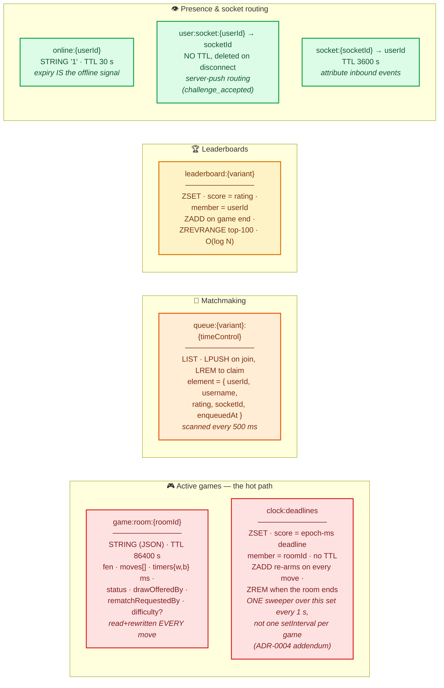
```mermaid
flowchart LR
    classDef room fill:#fee2e2,stroke:#dc2626,stroke-width:2px,color:#7f1d1d
    classDef q fill:#ffedd5,stroke:#ea580c,stroke-width:2px,color:#7c2d12
    classDef lb fill:#fef3c7,stroke:#d97706,stroke-width:2px,color:#78350f
    classDef pres fill:#dcfce7,stroke:#16a34a,stroke-width:2px,color:#14532d

    subgraph ROOMS["🎮 Active games — the hot path"]
        R1["game:room:{roomId}<br/>─────────────<br/>STRING (JSON) · TTL 86400 s<br/>fen · moves[] · timers{w,b} ms ·<br/>status · drawOfferedBy ·<br/>rematchRequestedBy · difficulty?<br/><i>read+rewritten EVERY move</i>"]:::room
        R2["clock:deadlines<br/>─────────────<br/>ZSET · score = epoch-ms deadline<br/>member = roomId · no TTL<br/>ZADD re-arms on every move ·<br/>ZREM when the room ends<br/><i>ONE sweeper over this set every 1 s,<br/>not one setInterval per game<br/>(ADR-0004 addendum)</i>"]:::room
    end

    subgraph QUEUES["🧲 Matchmaking"]
        Q1["queue:{variant}:{timeControl}<br/>─────────────<br/>LIST · LPUSH on join, LREM to claim<br/>element = { userId, username,<br/>rating, socketId, enqueuedAt }<br/><i>scanned every 500 ms</i>"]:::q
    end

    subgraph BOARDS["🏆 Leaderboards"]
        L1["leaderboard:{variant}<br/>─────────────<br/>ZSET · score = rating ·<br/>member = userId<br/>ZADD on game end ·<br/>ZREVRANGE top-100 · O(log N)"]:::lb
    end

    subgraph PRESENCE["👁 Presence & socket routing"]
        P1["online:{userId}<br/>STRING '1' · TTL 30 s<br/><i>expiry IS the offline signal</i>"]:::pres
        P2["user:socket:{userId} → socketId<br/>NO TTL, deleted on disconnect<br/><i>server-push routing<br/>(challenge_accepted)</i>"]:::pres
        P3["socket:{socketId} → userId<br/>TTL 3600 s<br/><i>attribute inbound events</i>"]:::pres
    end
```

---

## 16 · Deployment — Today vs. the Designed Split

### 16a — Stage 1 (running now): single instance, by decision not accident

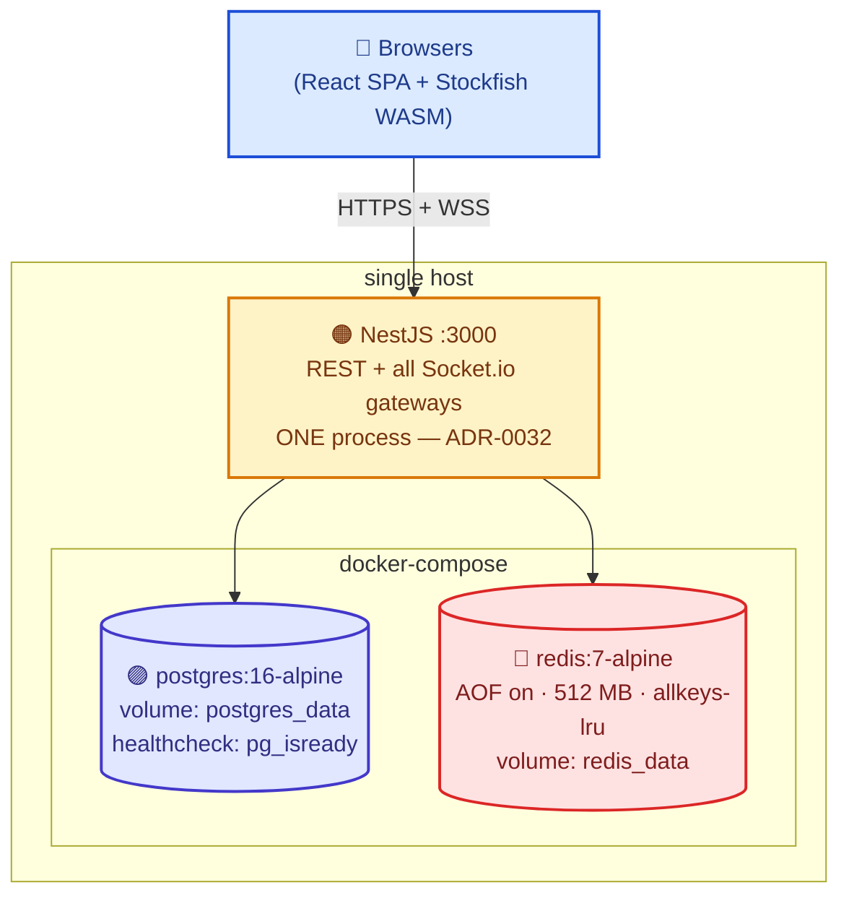
```mermaid
flowchart TB
    classDef client fill:#dbeafe,stroke:#1d4ed8,stroke-width:2px,color:#1e3a8a
    classDef server fill:#fef3c7,stroke:#d97706,stroke-width:2px,color:#78350f
    classDef infra fill:#fee2e2,stroke:#dc2626,stroke-width:2px,color:#7f1d1d
    classDef pg fill:#e0e7ff,stroke:#4338ca,stroke-width:2px,color:#312e81

    B1["🔵 Browsers<br/>(React SPA + Stockfish WASM)"]:::client

    subgraph HOST["single host"]
        N["🟠 NestJS :3000<br/>REST + all Socket.io gateways<br/>ONE process — ADR-0032"]:::server
        subgraph DC["docker-compose"]
            PG[("🟣 postgres:16-alpine<br/>volume: postgres_data<br/>healthcheck: pg_isready")]:::pg
            RD[("🔴 redis:7-alpine<br/>AOF on · 512 MB · allkeys-lru<br/>volume: redis_data")]:::infra
        end
    end

    B1 -- "HTTPS + WSS" --> N
    N --> PG
    N --> RD
```

**The 3 recorded blockers before instance #2 (ADR-0032 §"Before adding a second instance"):**

```text
1. WIRE @socket.io/redis-adapter in main.ts
   — installed but unwired; without it server.to(room).emit()
     only reaches sockets on the SAME process → silent desync

2. disconnectTimers: in-process Map → Redis keys with expiry
   — a reconnect handled by instance B must cancel
     a grace timer started on instance A

3. activeKeys: in-process Set → Redis SET
   + leader election (or dedicated worker) for the 500 ms
     pairing loop — two pollers would double-pair players
```

### 16b — Architecture B (trigger: >5 k concurrent sockets OR first deploy that kills a live game)

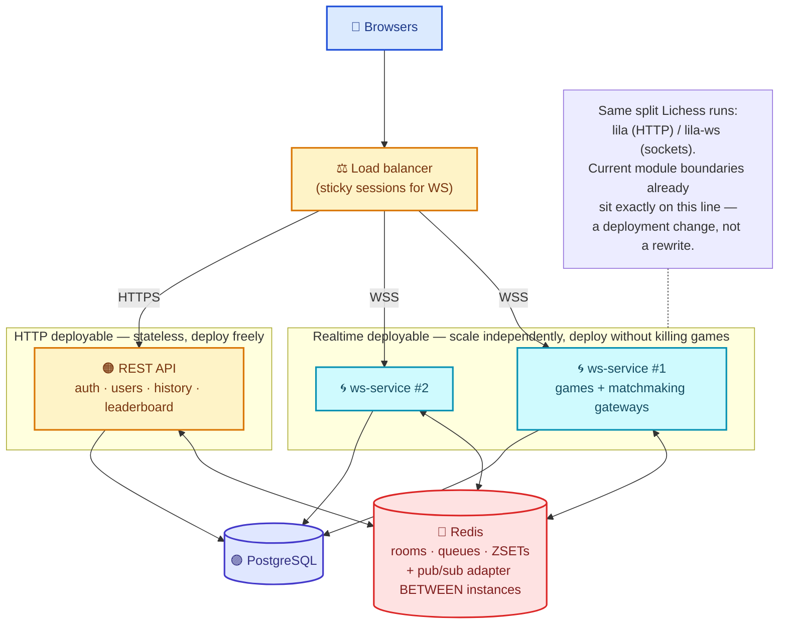
```mermaid
flowchart TB
    classDef client fill:#dbeafe,stroke:#1d4ed8,stroke-width:2px,color:#1e3a8a
    classDef server fill:#fef3c7,stroke:#d97706,stroke-width:2px,color:#78350f
    classDef ws fill:#cffafe,stroke:#0891b2,stroke-width:2px,color:#164e63
    classDef infra fill:#fee2e2,stroke:#dc2626,stroke-width:2px,color:#7f1d1d
    classDef pg fill:#e0e7ff,stroke:#4338ca,stroke-width:2px,color:#312e81

    B2["🔵 Browsers"]:::client
    LB["⚖ Load balancer<br/>(sticky sessions for WS)"]:::server

    subgraph WSLAYER["Realtime deployable — scale independently, deploy without killing games"]
        WS1["🌀 ws-service #1<br/>games + matchmaking gateways"]:::ws
        WS2["🌀 ws-service #2"]:::ws
    end

    subgraph API["HTTP deployable — stateless, deploy freely"]
        A1["🟠 REST API<br/>auth · users · history · leaderboard"]:::server
    end

    RD2[("🔴 Redis<br/>rooms · queues · ZSETs<br/>+ pub/sub adapter BETWEEN instances")]:::infra
    PG2[("🟣 PostgreSQL")]:::pg

    B2 --> LB
    LB -- "WSS" --> WS1 & WS2
    LB -- "HTTPS" --> A1
    WS1 <--> RD2
    WS2 <--> RD2
    A1 <--> RD2
    A1 --> PG2
    WS1 --> PG2
    WS2 --> PG2

    NOTE["Same split Lichess runs:<br/>lila (HTTP) / lila-ws (sockets).<br/>Current module boundaries already<br/>sit exactly on this line —<br/>a deployment change, not a rewrite."]
    NOTE -.- WSLAYER
```

---

*All diagrams reflect the codebase at the Stage 1 cut (2026-07-19, ADR-0032). Where a
mechanism is designed-but-pending (server clock sweeper per ADR-0004, the multi-instance
blockers), the diagrams show today's behavior and label the variance.*
