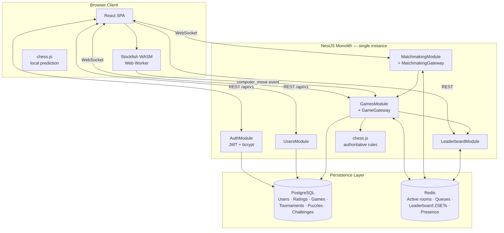
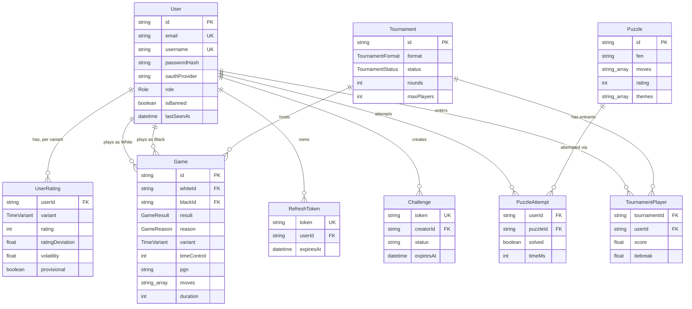
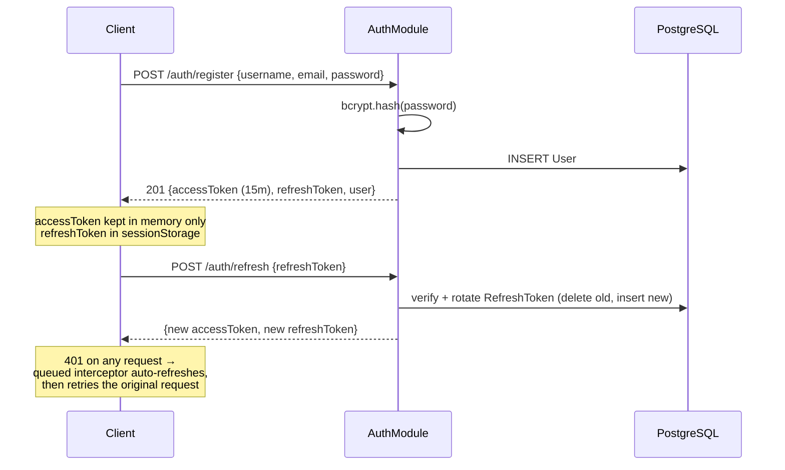
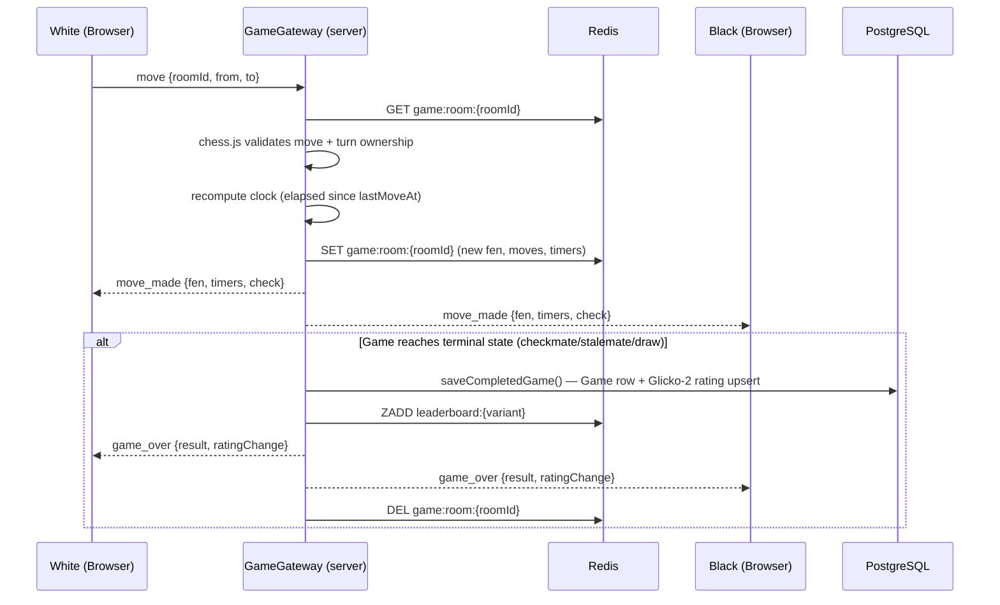

# WChess — A Real-Time Distributed Chess Platform

### Project Stage 1 Report — 7th Semester

**Bachelor of Engineering (Computer Engineering)**
D. Y. Patil College of Engineering, Akurdi, Pune

| | |
|---|---|
| **Author** | Aditya Gorane |
| **Team** | Aditya Gorane (Team Leader), Dnyanesh Gore, Kartik Deore, Chaitanya Godse |
| **Guide** | Mrs Vailashi Kolhe |
| **Academic Year** | 2026-2027 |
| **Repository** | `ChessWeb` (internal codename), user-facing product name **WChess** |

---

## Table of Contents

1. [Abstract](#1-abstract)
2. [Introduction & Problem Statement](#2-introduction--problem-statement)
3. [Project Stage 1 Scope](#3-project-stage-1-scope)
4. [Why This Is Not "Just a Chess Website"](#4-why-this-is-not-just-a-chess-website)
5. [System Architecture](#5-system-architecture)
6. [Database Design](#6-database-design)
7. [Network & Communication Architecture](#7-network--communication-architecture)
8. [Core Algorithms & Engineering Depth](#8-core-algorithms--engineering-depth)
9. [Features](#9-features)
10. [Security Engineering](#10-security-engineering)
11. [Software Engineering Practices](#11-software-engineering-practices)
12. [Deployment Architecture & Scalability Path](#12-deployment-architecture--scalability-path)
13. [Known Limitations](#13-known-limitations-tracked-transparently)
14. [Roadmap / Future Work](#14-roadmap--future-work)
15. [Conclusion](#15-conclusion)

---

## 1. Abstract

WChess is a full-stack, real-time multiplayer chess platform engineered around the same
class of distributed-systems problems that power production platforms like Lichess and
Chess.com: authoritative real-time state synchronization over WebSockets, skill-based
matchmaking under uncertainty, a statistically rigorous rating system, and a polyglot
persistence layer that separates durable relational data from ephemeral, high-frequency
real-time state.

Unlike a typical academic chess project — which usually renders a local two-player board
in the browser and calls it done — WChess is architected as a **client-server real-time
system**: the backend is the single source of truth for every game, matches players by
rating with a fairness/latency trade-off algorithm, computes ratings using the **Glicko-2**
system (the same algorithm used by Lichess, strictly more expressive than the classical Elo
taught in most textbooks), and persists results transactionally. Every architectural
decision — monolith vs. microservices, SQL vs. NoSQL vs. cache, server-side vs. client-side
chess engine execution — is recorded as a written **Architecture Decision Record (ADR)**
with context, trade-offs, and a reversal trigger, rather than assumed.

This report documents the system as it exists at the end of Project Stage 1: a working,
network-verified core (authentication, a fully rules-complete live game engine, three
matchmaking modes, a browser-side Stockfish AI opponent, Glicko-2 ratings, and a
leaderboard), plus a deliberately scoped, already-designed roadmap (tournaments, puzzles,
social features, chat, post-game engine analysis) for Stage 2.

---

## 2. Introduction & Problem Statement

Online chess is deceptively hard to build correctly. The chessboard itself — legal move
generation, check/checkmate/stalemate detection — is a solved problem with mature libraries
(`chess.js`). The actual engineering difficulty of a platform like Lichess or Chess.com lies
almost entirely *outside* the board:

- **Who do you play?** Two strangers of similar skill need to find each other in seconds,
  not minutes — a matchmaking problem, not a chess problem.
- **Whose move is it, really?** In a real-time multiplayer game, the server — not either
  browser — must be the single authority on game state, or a malicious or buggy client can
  desync the game or fabricate a result.
- **How good is a player, actually?** A single win/loss count says nothing. A statistically
  sound rating system has to model *uncertainty* (a new player's rating is a guess, not a
  fact) and *decay* (an inactive player's rating should become less certain over time).
- **Where does data live?** A finished game is a permanent record (needs ACID durability).
  An in-progress game's clock ticks 10 times a second (needs sub-millisecond read/write, not
  durability). These are different engineering problems and conflating them into one
  database is a common student-project mistake.
- **What happens when a player's WiFi drops mid-game?** A production system needs a grace
  period, a reconnect path, and an eventual authoritative resolution — not an infinite hang.

WChess's problem statement is to solve each of these as a *distinct, correctly-scoped
subsystem*, using the same architectural vocabulary (ADRs, service boundaries, polyglot
persistence) that real engineering teams use — while staying small enough for a two-person,
one-semester team to actually ship and defend.

---

## 3. Project Stage 1 Scope

Given the one-semester timeline, the team made a deliberate, **documented** scope cut
(`ADR-0032`, dated 2026-07-19) rather than attempting all originally-planned modules at low
quality. The original plan spanned 12 backend modules and 51 implementation increments; v1
was cut to the 6 modules that constitute a *complete, correct, playable product end to end*:

| Included in v1 (Stage 1) | Cut to roadmap (Stage 2+) |
|---|---|
| Authentication (JWT, bcrypt) | Chat |
| Live Game Engine (full rules, clocks, draws, resign, reconnect) | Notifications |
| Matchmaking (quick match, friend challenge, vs-computer) | Tournaments (Swiss/Arena/RR/KO) |
| Stockfish AI opponent (browser WASM, 5 difficulty levels) | Puzzles (spaced repetition) |
| Glicko-2 Rating Engine | Social (friends, follow, activity feed) |
| Leaderboard | Post-game Analysis (engine eval, move classification) |

This is presented in full in this report (Section 9) with both halves clearly labeled —
what runs today versus what is architecturally designed and queued. Deferring a feature and
never having planned for it are different engineering situations, and the report treats
them as such.

---

## 4. Why This Is Not "Just a Chess Website"

A "chess website" built as a typical semester project is usually a client-side-only React
app: two people share one browser tab, or a peer-to-peer WebRTC hack simulates
multiplayer. WChess is deliberately **not** that. The selling points below are properties of
the *system*, independent of the chessboard itself:

1. **Server-authoritative real-time state.** Every legal-move check, clock decrement, and
   game-ending condition is evaluated once, on the server, against a single Redis-resident
   source of truth (`game:room:{roomId}`). Neither client's local board state is trusted;
   moves are re-validated server-side with `chess.js` regardless of what the client claims.
   This is the same trust model production multiplayer games use, and it is what makes
   ratings meaningful — a client cannot fabricate a win.

2. **A statistically real rating system, not a toy Elo.** WChess implements **Glicko-2**
   in full (`common/utils/elo.ts`): rating (`μ`), rating deviation (`φ`, confidence), and
   volatility (`σ`), including the Illinois-algorithm root-finding step for volatility
   convergence. New players are explicitly marked `provisional` while their RD is high.
   Most student chess projects hardcode `rating += 15` on a win; this system quantifies
   *how sure* the platform is about a player's skill, which is the actual hard part of
   rating design.

3. **A matchmaking algorithm with a fairness/latency trade-off, engineered on purpose.**
   Rather than "first two players in the queue play," the matchmaker widens acceptable
   rating tolerance over time (`±50` at t=0 up to `±400` at ~29s, see §8.2) and always
   offers a match to the longest-waiting player first — a documented, tunable policy
   (ADR-0008), not an accident of implementation order.

4. **Concurrency correctness under real race conditions.** Two players clicking "Accept"
   on the same challenge link within milliseconds of each other is a genuine
   time-of-check-to-time-of-use (TOCTOU) race. WChess closes it with an atomic
   conditional database update (`updateMany({ where: { status: 'pending' } })`) so exactly
   one request wins and the other receives a clean `409 CONFLICT` — verified live with two
   parallel accept requests.

5. **Polyglot persistence, chosen for the access pattern, not by default.** PostgreSQL
   (via Prisma, fully typed and migration-tracked) holds durable, relational,
   transactionally-consistent data. Redis holds ephemeral, extremely hot, TTL-bounded
   state: active game rooms, matchmaking queues, and rating leaderboards as sorted sets.
   Section 6.3 explains *why* each store owns what it owns — this is a CAP-theorem-aware
   decision, not two databases for the sake of having two databases.

6. **A browser-executed chess AI, to solve a real cost problem.** Running Stockfish
   server-side for every vs-computer move is expensive to scale (CPU-bound, per-request).
   WChess runs Stockfish **compiled to WebAssembly inside the human player's own browser**
   (ADR-0009) as a Web Worker speaking the UCI protocol, at 5 tunable skill levels. The
   server's only job is to re-validate the resulting move is legal, that it's actually the
   engine's turn, and that the sender is the room's real human player — so a tampered
   client can only sabotage its own (unrated) game, never gain an advantage. This is a
   deliberate compute-offloading architecture decision with a written security rationale,
   not "the AI runs in JavaScript because that was easier."

7. **Every non-trivial architectural choice is a written, dated ADR** with context,
   the decision, and consequences — including the *negative* consequences accepted, and
   the measurable condition that would trigger revisiting it later (see §11). This is
   standard practice at engineering organizations (Lichess itself publishes its
   architecture this way) and is uncommon at the student-project level.

8. **The scaling path is already designed, not hand-waved.** The system runs today as a
   single-instance modular monolith *by deliberate choice* — the report explains exactly
   why (§12) — with the exact three things that must change before a second instance can
   be added (§13), and a named target architecture (Lichess's `lila`/`lila-ws` split) for
   when load actually demands it.

---

## 5. System Architecture

### 5.1 Technology Stack

| Layer | Technology | Rationale |
|---|---|---|
| Frontend | React 18, Vite, Tailwind CSS, React Router | Fast dev server (Vite HMR), component-based UI, utility-first styling for a custom design system |
| Real-time client | Socket.io-client | Automatic reconnection, fallback transports, room-based broadcast primitives |
| Chess rules (client) | `chess.js` | Move legality, SAN generation, FEN parsing — shared logic between client prediction and server validation |
| AI opponent | `stockfish` (WASM, `stockfish-18-lite-single` build) | Runs client-side as a Web Worker over UCI; no SharedArrayBuffer/COOP-COEP requirement (single-threaded build), so no special server headers needed |
| Backend framework | NestJS (TypeScript) | Dependency-injected, modular architecture (`@Module`) that maps 1:1 onto the system's actual service boundaries; first-class Socket.io gateway support |
| Real-time transport | Socket.io (server) | Room-based pub/sub, namespace isolation per concern (`/`, future `/chat`, `/notifications`) |
| Primary datastore | PostgreSQL 16 via Prisma ORM | ACID-compliant relational store for durable, queryable data (users, ratings, games, tournaments) |
| Cache / real-time state | Redis 7 via `ioredis` | Sub-millisecond read/write for active game rooms, matchmaking queues, and leaderboard sorted sets |
| Authentication | JWT (HS256) + Passport.js (`LocalStrategy`, `JwtStrategy`) + bcrypt | Stateless access tokens, rotating refresh tokens persisted server-side for revocation |
| Rate limiting | `@nestjs/throttler` | Sliding-window request throttling (configured; wiring status noted in §13) |
| Containerized infra | Docker Compose (Postgres + Redis) | Reproducible local dev environment matching the target deploy topology |

### 5.2 High-Level Architecture



### 5.3 Modular Monolith: An Engineered, Not Accidental, Decision

A natural instinct for a "chess platform" is to reach for microservices because that is
what large-scale production systems use. WChess's architecture explicitly rejects that
by default and documents why (`ADR-0032`):

> A full audit of actual inter-module coupling found only **two** cross-module
> dependencies in the entire backend (`games → leaderboard`, `matchmaking → games`) plus
> one shared guard (`JwtAuthGuard`). Decomposing into services at that coupling level
> would convert the one relationship that *must* be transactionally consistent — a
> completed game writing its rating change — into a distributed transaction (a saga or
> outbox pattern), replacing a single `await` with a whole new failure-handling
> subsystem, for no present benefit.

**Decision:** stay a **modular monolith**, deployed as a single instance, with module
boundaries (`AuthModule`, `GamesModule`, `MatchmakingModule`, …) drawn exactly where a
future service split would occur. This is Martin Fowler's "monolith-first" pattern,
applied deliberately rather than as a default.

**The trigger to split is explicit, not vibes-based:** sustained >5,000 concurrent
WebSocket connections, *or* the first time a non-game deploy interrupts a live game. At
that point the plan (Architecture B) is to split the WebSocket layer (`games`,
`matchmaking`) into its own deployable with Redis pub/sub bridging it to the REST API —
the same split Lichess uses between `lila` (Play Framework, HTTP) and `lila-ws` (Scala,
WebSocket-only).

### 5.4 Service / Module Map

```
backend/src/
├── auth/           — register, login, JWT issuance, refresh-token rotation, logout
├── users/          — profile CRUD, public profile lookup
├── games/          — GameGateway (Socket.io): move validation, clocks, draws,
│                     resign, takeback, reconnect handling, terminal-state detection
├── matchmaking/     — MatchmakingService: Redis-queue polling loop, rating-tolerance
│                     widening, atomic pairing; MatchmakingController: friend
│                     challenges, vs-computer game creation
├── leaderboard/    — Redis ZSET-backed top-N rank queries
└── common/
    ├── prisma/     — PrismaService (typed Postgres client)
    ├── redis/      — RedisService (ioredis wrapper: get/set/JSON/list/sorted-set ops)
    └── utils/elo.ts — Glicko-2 rating engine, variant classification
```

Each module is independently unit-testable (NestJS's DI container lets any provider be
mocked), and each maps directly onto a bounded context that could become an independent
deployable in Architecture B without redrawing any boundaries.

---

## 6. Database Design

### 6.1 Relational Schema — PostgreSQL via Prisma



**Design notes:**

- **`UserRating` is per-variant, not a single number on `User`.** A player's Bullet
  rating and Classical rating are statistically independent skill estimates in real
  chess-rating systems (a strong blitz player is not necessarily a strong classical
  player) — modeling this as one row per `(userId, variant)` rather than a flat column
  reflects that domain fact directly in the schema, with `@@unique([userId, variant])`
  enforcing one rating per variant per user at the database level.
- **`Game` is an immutable, append-only record.** Once written, a completed game is never
  updated — it stores the full move list, final FEN, and PGN, so game history and
  post-game analysis (Stage 2) can be reconstructed from Postgres alone without touching
  Redis.
- **Indexes are chosen for actual query shape**, not defaults: `@@index([whiteId,
  createdAt(sort: Desc)])` and the symmetric black index directly serve "a user's game
  history, most recent first" (`GET /games/history/:userId`) as an index-only scan.
  `@@index([variant, rating(sort: Desc)])` on `UserRating` means the leaderboard's "top
  100 by rating" query can be served by an `ORDER BY … LIMIT 100` against Postgres alone
  — the Redis leaderboard ZSET (§6.2) is a performance optimization layered *on top of* an
  already-correct relational query path, not a replacement for one.
- **`Challenge` is a short-lived, self-expiring record** (10-minute TTL enforced at the
  application layer, `status` state machine `pending → accepted | expired`), used to
  implement shareable "play a friend" links without requiring both players to be online
  simultaneously at creation time.
- **CUID primary keys** (`@default(cuid())`) rather than auto-increment integers: sortable,
  collision-resistant, and safe to generate client-side or across future service
  boundaries without a central sequence.

### 6.2 Redis Data Model

Redis is used exactly where its data structures match the access pattern, not as a
general-purpose second database:

| Key Pattern | Structure | Purpose |
|---|---|---|
| `game:room:{roomId}` | String (JSON), TTL 86400s | The single source of truth for an in-progress game: FEN, move list, both players' clocks in ms, draw-offer state, difficulty (if vs-computer). Read and rewritten on every move. |
| `queue:{variant}:{timeControl}` | List (LPUSH / LREM) | FIFO-ish matchmaking queue per (variant, time control) pair. A 500ms server-owned polling loop scans it for pairable candidates. |
| `leaderboard:{variant}` | Sorted Set (ZSET), score = rating | O(log N) rank queries and O(log N + M) top-N range queries — the reason a leaderboard is a ZSET problem, not a `SELECT … ORDER BY` problem, at read-heavy scale. |
| `online:{userId}` | String, TTL 30s | Heartbeat-refreshed presence flag; a stale key expiring *is* the "user went offline" signal — no explicit disconnect handling required for presence. |
| `user:socket:{userId}` | String → socketId | Reverse index used to push server-initiated events (e.g. `challenge_accepted`) to a specific user's live connection regardless of which room they're in. |
| `socket:{socketId}` | String → userId | Forward index, populated on `handleConnection`, used to attribute an inbound socket event to an authenticated user. |

**Why Redis and not just Postgres for game rooms:** an active game's state changes on
every move — potentially multiple times per second in Bullet chess — and is *disposable*
the instant the game ends (it's flattened into the permanent `Game` row and the Redis key
is deleted). Writing that churn to Postgres would mean either constant row updates against
a durable WAL-backed store for data that's thrown away in minutes, or an event-sourced
move log that reconstructs current state on every read — both far more machinery than an
in-memory JSON blob with a TTL safety net. This is a textbook instance of choosing a data
store by write/read pattern and durability requirement, not by default familiarity.

### 6.3 Polyglot Persistence Rationale

| Requirement | Store | Why |
|---|---|---|
| Durable, auditable, relational (users, finished games, ratings) | PostgreSQL | ACID guarantees; a finished game's result and rating change must never be lost or partially written — enforced with `prisma.$transaction` around the multi-table rating write (see §13 for current gap). |
| Ephemeral, extremely hot, single-key state (live game rooms) | Redis | Sub-millisecond latency; TTL as an automatic cleanup mechanism; no durability requirement once the game ends. |
| Ranked/ordered read-heavy queries (leaderboard) | Redis ZSET (with Postgres as source of truth) | O(log N) instead of a full sort; explicitly documented in `ADR-0032` as "kept because it works, not because it's required" — the honest engineering call, since the indexed Postgres query would suffice. |
| Rate limiting / sliding windows | Redis ZSET (timestamp-scored) | Atomic `ZADD` + `ZREMRANGEBYSCORE` gives a correct sliding window without a cron job. |

A prior iteration of the system also used MongoDB for chat messages, notifications, and
game analysis documents. When those modules were cut from v1 scope (`ADR-0032`), MongoDB
was removed entirely rather than kept "for later" — its only three consumers left with the
scope cut, so keeping an idle third database around would have been unjustified
infrastructure. It returns, if at all, when those modules do.

---

## 7. Network & Communication Architecture

WChess uses two distinct network protocols, deliberately chosen per interaction type:
**REST** for request/response operations (auth, profile, history — anything where the
client asks once and gets one answer), and **WebSocket (Socket.io)** for anything
continuous or server-pushed (live game state, matchmaking queue status, presence).

### 7.1 REST API Surface (`/api/v1`)

| Domain | Key Endpoints |
|---|---|
| Auth | `POST /auth/register`, `POST /auth/login`, `POST /auth/refresh`, `POST /auth/logout`, `GET /auth/me` |
| Users | `GET /users/:username`, `PATCH /users/me`, `GET /users/:username/stats` |
| Games | `GET /games/:id`, `GET /games/history/:userId`, `GET /games/live` |
| Matchmaking | `POST /matchmaking/challenge`, `POST /matchmaking/challenge/:token/accept`, `POST /matchmaking/computer`, `GET /matchmaking/queue-status` |
| Leaderboard | `GET /leaderboard?variant=&period=`, `GET /leaderboard/rank/:userId` |

All protected routes require `Authorization: Bearer <accessToken>`. Errors follow a
consistent envelope with a machine-readable `code` (e.g. `CHALLENGE_EXPIRED`,
`CANNOT_ACCEPT_OWN_CHALLENGE`) alongside the human-readable `message`, so the frontend can
branch on `code` without string-matching prose.

### 7.2 WebSocket Protocol — Game Gateway

Authentication happens once, at the socket handshake, by verifying the JWT out of
`socket.handshake.auth.token` — an unauthenticated socket is disconnected immediately, so
every subsequent event on that connection is already known to belong to a specific user.

| Client → Server | Server → Client |
|---|---|
| `join_queue`, `leave_queue` | `queued`, `queue_position` (every 5s), `match_found` |
| `join_room`, `move`, `resign` | `game_start`, `game_state` (reconnect), `move_made`, `invalid_move` |
| `offer_draw` / `accept_draw` / `decline_draw` | `draw_offered`, `draw_declined` |
| `request_takeback` / `accept_takeback` / `decline_takeback` | `takeback_requested`, `takeback_accepted`, `takeback_declined` |
| `claim_timeout`, `rematch_request` | `game_over` (with rating deltas), `rematch_offered`, `rematch_ready` |
| `computer_move` (relays the browser AI's chosen move) | `opponent_disconnected` (with grace period), `opponent_reconnected` |

### 7.3 Authentication & Session Flow



Access tokens are short-lived JWTs (stateless, HS256-signed); refresh tokens are
persisted server-side (`RefreshToken` table) and **rotated** on every use — the old token
is deleted and a new one issued in the same operation, so a leaked, already-used refresh
token is immediately worthless. Logout deletes the token server-side, which is why
refresh tokens (unlike access tokens) can actually be revoked.

### 7.4 Sequence Diagram — A Move in a Live Game



Every move is re-validated server-side against the room's Redis-resident FEN using
`chess.js` — the *server's* board, not the client's — which is what makes it impossible
for either browser to fabricate a move, a turn, or a game result.

---

## 8. Core Algorithms & Engineering Depth

This section is the heart of the report: the parts of the system that require actual
algorithmic reasoning, not just CRUD wiring.

### 8.1 The Glicko-2 Rating System

Most student projects implement Elo (`newRating = oldRating + K * (actualScore -
expectedScore)`). WChess implements **Glicko-2**, published by Mark Glickman, which models
each player as a *distribution*, not a point estimate:

- **`μ` (rating)** — the skill estimate, same role as Elo's rating.
- **`φ` (RD, rating deviation)** — how *confident* the system is in that estimate. A brand
  new player has `φ = 350` (very uncertain); a long-established player might have `φ = 45`.
  A player is flagged `provisional` in the schema while `φ > 110`.
- **`σ` (volatility)** — how erratically a player's true skill appears to fluctuate.

The rating update (`common/utils/elo.ts::updateGlicko2`) implements the full published
algorithm: converting to the internal Glicko-2 scale, computing the estimated variance `v`
and rating change `Δ`, then solving for the new volatility via the **Illinois algorithm**
(a modified regula-falsi root-finder that converges faster than bisection alone) before
recombining into a new `(μ, φ)`. This means:

- A win against a much stronger, established opponent moves your rating **more** than a
  win against an equal.
- A new player's rating moves in **large swings** at first (`φ` is high) and stabilizes as
  more games narrow the uncertainty — exactly the intended statistical behavior, not a
  hand-tuned K-factor.
- `φ` is clamped to `[30, 350]` post-update so a player's confidence bound never collapses
  to zero or explodes unboundedly.

### 8.2 Matchmaking: Fairness vs. Latency, Solved as a Tunable Trade-off

The matchmaking problem is: pair players close enough in skill to be a fair game, without
making anyone wait too long. These pull in opposite directions, so WChess treats the
acceptable rating gap as a function of wait time rather than a fixed constant
(`ADR-0008`):

```
tolerance(waitSeconds) = min(50 + waitSeconds × 12, 400)
```

A player who just joined the queue will only be matched within ±50 rating points; a
player who has waited ~29 seconds will accept an opponent up to ±400 away. When
considering a candidate pair, the algorithm takes the **stricter** (smaller) of the two
players' individual tolerances — so a fresh player can't be forced into an unfair match
just because their prospective opponent has been waiting a long time.

**Pairing policy:** on each 500ms polling cycle, candidates in a given `(variant,
timeControl)` queue are sorted by wait time, and the *longest-waiting* players are given
first opportunity to pair — a starvation-avoidance policy, not first-fit.

**Atomicity of the claim:** once a pair is selected, both queue entries are removed with
`LREM` before a game room is created. If the second `LREM` finds its target already gone
(the opponent disconnected between selection and claim), the first player's entry is
pushed back onto the queue rather than silently dropped — verified by design to avoid the
failure mode of a player vanishing from the queue with no match and no error.

### 8.3 Concurrency Correctness: The Double-Accept Race

A friend-challenge link (`POST /matchmaking/challenge/:token/accept`) can be opened by
two people, or clicked twice, within the same tens-of-milliseconds window — a genuine
**time-of-check-to-time-of-use (TOCTOU)** race if implemented naively as "read status,
check it's pending, then update it." WChess closes this with a single **conditional
atomic update**:

```typescript
const claimed = await prisma.challenge.updateMany({
  where: { token, status: 'pending' },
  data: { status: 'accepted' },
});
if (claimed.count === 0) throw new ConflictException('CHALLENGE_ALREADY_ACCEPTED');
```

The `WHERE status = 'pending'` clause is evaluated by Postgres atomically against the
current row — exactly one concurrent request can ever see `count === 1`; every other
concurrent request sees `count === 0` and receives a clean `409`. This was verified by
firing two simultaneous accept requests against a live server and confirming exactly one
`201` and one `409` — not merely reasoned about, but tested under real concurrency.

### 8.4 Client-Side AI: Offloading Compute to the Browser

Running a chess engine strong enough to be a believable opponent (Stockfish) is CPU-heavy.
Running it **server-side**, per move, per active vs-computer game, means server cost scales
linearly with concurrent AI games — an expensive, hard-to-cap liability for a system with
no revenue model. WChess instead compiles Stockfish to **WebAssembly** and runs it as a
**Web Worker inside the human player's own browser** (`ADR-0009`), speaking the standard
**UCI (Universal Chess Interface)** protocol used by essentially every chess engine:

- Difficulty levels 1–5 map to UCI `Skill Level` (0–20) plus a `movetime` budget
  (200–1500ms), so difficulty is a real engine-strength parameter, not a fake delay.
- The engine's chosen move is relayed to the server over a dedicated `computer_move`
  socket event, which the server re-validates end-to-end: the room must actually be a
  vs-computer room, the sender must be that room's real human (white) player, it must
  genuinely be the engine's (black's) turn, and `chess.js` must still rule the move legal.
  A tampered client can therefore only make its own opponent play badly in an **unrated**
  game — there is no path to gaining rating or defeating a human this way.
- This trades a small amount of server trust (re-validation, not re-computation) for a
  large, permanent reduction in server compute cost — the correct trade for a system where
  the AI opponent's moves don't need to be secret from the one player who already sees
  them on their own board.

### 8.5 Real-Time State Machine: Disconnects, Reconnects, and Timeouts

Each game room moves through an explicit state machine: `waiting → active → ended`. On
disconnect, the server does not immediately forfeit the game — it emits
`opponent_disconnected` with a 60-second grace period and starts a server-side timer. If
the disconnected player's socket rejoins (`join_room`) before the timer fires, the timer is
cancelled and `opponent_reconnected` is broadcast; the reconnecting client is sent a full
`game_state` snapshot (FEN, clocks, move list) so it can resume exactly where the game left
off, regardless of what its local state was before the drop. If the grace period expires,
the game is auto-resolved as an `ABANDONED` loss for the disconnected side and rated
accordingly. This converts an ambiguous network failure into a bounded, deterministic
outcome — the property a production real-time system needs and a toy one usually skips.

---

## 9. Features

### 9.1 Implemented — Working End-to-End (v1 / Stage 1)

| Feature | Detail |
|---|---|
| **Authentication** | Register/login (bcrypt + JWT), silent token refresh with rotation, protected routes, logout that actually revokes the refresh token |
| **Live Game Engine** | Full chess rules via `chess.js` (checkmate, stalemate, insufficient material, threefold repetition, fifty-move draw), server-tracked per-side clocks with increment, resign, draw offer/accept/decline, takeback request/accept/decline, rematch flow with color swap |
| **Reconnection Handling** | 60-second grace period, state resync on rejoin, auto-abandon after grace expiry |
| **Matchmaking — Quick Match** | Rating-tolerance-widening queue (§8.2), live queue-position updates every 5s |
| **Matchmaking — Friend Challenge** | Shareable, expiring (10-min) challenge links with configurable color preference, race-safe accept (§8.3) |
| **Matchmaking — vs. Computer** | Instant game creation against the browser-side Stockfish AI at 5 difficulty levels |
| **Stockfish AI Opponent** | WASM engine in a Web Worker, UCI protocol, server-validated moves (§8.4) |
| **Rating Engine** | Full Glicko-2 per time-control variant (Bullet/Blitz/Rapid/Classical), provisional-rating flagging |
| **Leaderboard** | Redis-ZSET-backed top-100 rankings per variant |
| **Game History** | Paginated, per-user, filterable by variant |
| **UI/UX** | Custom monochrome neo-brutalist design system (hard shadows, 3px borders, Archivo Black/Space Grotesk/Space Mono typography), fully responsive, drag-and-drop board with color-locked pieces, pre-move support |

### 9.2 Designed & Roadmapped (Stage 2+)

These modules already have Prisma schema and/or backend scaffolding in the codebase's
history and full design docs (`docs/features/`); they were consciously deferred
(`ADR-0032`) rather than built to a lower standard:

| Feature | Design status | Re-entry cost |
|---|---|---|
| **Chat** (in-game + lobby) | MongoDB schema designed, gateway scaffolded | Low — needs a room-authorization check added before it returns |
| **Notifications** | MongoDB schema designed, REST CRUD scaffolded | Low — needs the real-time delivery gateway |
| **Tournaments** (Swiss / Round-Robin / Knockout / Arena) | Full Prisma schema (`Tournament`, `TournamentPlayer`), CRUD scaffolded | High — the Swiss pairing algorithm itself is the large remaining piece |
| **Puzzles** (tactics training) | Full Prisma schema (`Puzzle`, `PuzzleAttempt`), daily-puzzle + attempt endpoints scaffolded | Medium — needs a puzzle dataset import (Lichess's open puzzle database is the intended source) and an SM-2 spaced-repetition scheduler |
| **Social** (friends, follow, activity feed) | Designed, not yet in schema | Medium |
| **Post-Game Analysis** | MongoDB schema designed (per-move eval, centipawn-loss classification, accuracy score) | High — requires a server-side engine analysis worker (BullMQ job queue already chosen for this) |

---

## 10. Security Engineering

- **Password storage:** bcrypt with per-password salt, never plaintext or reversibly
  encrypted.
- **Token design:** short-lived (15m) stateless access tokens limit the blast radius of a
  leaked token; refresh tokens are long-lived but server-persisted and rotated on every
  use, so token theft is detectable (a reused, already-rotated refresh token is a signal of
  compromise) and revocable (logout deletes it server-side).
- **Authorization boundaries enforced server-side, never trusted from the client:** a
  socket cannot move a piece it doesn't own, cannot accept its own draw offer, cannot
  accept its own challenge, and cannot claim a timeout that hasn't occurred — every one of
  these is re-checked against server-held state, not client-asserted data.
- **Rate limiting:** `@nestjs/throttler` configured for sliding-window request limiting
  (current wiring status tracked honestly in §13, not glossed over).
- **Input validation:** DTOs validated at the framework boundary via `class-validator`
  (e.g. `IsIn` on time-variant enums) before any handler logic runs.
- **Unrated-by-design AI games:** because computer games never touch the rating system,
  the one path with a client-supplied AI move (§8.4) has literally nothing of value for a
  tampered client to gain — a security property achieved by data-model design, not by an
  extra guard clause.

---

## 11. Software Engineering Practices

- **Architecture Decision Records (ADRs).** Every consequential technical decision —
  monolith vs. microservices, MongoDB's removal, the client-side vs. server-side chess
  engine question, matchmaking tolerance policy — is written down with **Context**,
  **Decision**, and **Consequences** (including negative ones, stated plainly), plus an
  explicit **trigger condition** for revisiting it. This is the same practice used at
  companies like Spotify, ThoughtWorks, and AWS teams, applied at student-project scale.
- **Feature-branch workflow.** Each functional area (`feature/auth`,
  `feature/game-engine`, `feature/matchmaking`, `feature/stockfish`, …) is developed on its
  own branch off `dev`, broken into small, independently-completable increments, and
  merged only once verified — never committed directly to `main`.
- **Documented, not hidden, technical debt.** Rather than silently shipping known gaps,
  the project tracks them explicitly (see §13) with the exact file and line where the gap
  lives and why it matters — e.g. "the Redis pub/sub adapter for multi-instance
  broadcasting is installed but not wired into `main.ts` yet" is recorded as a named,
  located, and prioritized item, not discovered later by surprise.
- **Contradiction detection between design docs and code.** During development, two
  cases were found where an accepted ADR's design and the actual shipped code disagreed
  (a stale server-side computer-move path contradicting the browser-WASM decision; a
  designed-but-never-built server-authoritative clock). Both were resolved by treating the
  ADR as the source of truth and either deleting the contradicting code or scheduling the
  missing implementation — a doc-vs-code audit practice, not just a code review.

---

## 12. Deployment Architecture & Scalability Path

**Current (Stage 1) deployment topology:** a single NestJS process plus two containerized
stateful services (PostgreSQL, Redis) via Docker Compose — one Postgres instance with a
health-checked startup, one Redis instance configured with an LRU eviction policy and AOF
persistence for durability of queue/session state across restarts.

**Single-instance is a deliberate, recorded constraint, not an oversight.** Three specific
things are correct *only* on one process and documented as exactly what must change before
a second instance is added:

1. Wire the already-installed `@socket.io/redis-adapter` into `main.ts` — without it,
   `server.to(room).emit()` only reaches sockets connected to *that* process, so two
   players on different instances would silently desync.
2. Move `disconnectTimers` (currently an in-process `Map`) into Redis keys with expiry, so
   a disconnect grace-period timer survives regardless of which instance handles the
   reconnect.
3. Move `activeKeys` (the matchmaking service's in-process tracking of live queue keys)
   into a Redis `SET`, with either leader election or a dedicated single worker owning the
   500ms polling loop, so two instances don't double-pair the same queue.

**Target architecture at scale (Architecture B):** split the WebSocket-handling modules
(`games`, `matchmaking`, future `chat`) into their own deployable service, communicating
with the stateless REST API via Redis pub/sub — mirroring Lichess's own
`lila` (HTTP, Play/Scala) / `lila-ws` (WebSocket-only, Scala) split. The module boundaries
in the current monolith already sit exactly on this line, so the split is a deployment
change, not a rewrite.

---

## 13. Known Limitations (Tracked Transparently)

A report that only lists what works is less credible than one that also states, precisely,
what doesn't yet — and why that's a scoped decision rather than an unknown gap.

| # | Limitation | Why it's tracked, not fixed yet |
|---|---|---|
| 1 | **Server-authoritative clock (ADR-0004) is accepted but not implemented.** Clocks only advance when a move arrives; a timeout is detected only via a client-sent `claim_timeout`. A game whose opponent simply closes the browser (never claims timeout) hangs until Redis's 86400s room TTL — it is never persisted or rated. | Design is settled (a Redis sorted-set "deadline sweeper" — one timer for all games, not one per game, so it also survives a restart); implementation is the top item for the next sprint. |
| 2 | **Rating-write atomicity.** `saveCompletedGame` performs the Postgres `Game` insert and both players' `UserRating` upserts as separate sequential writes rather than one `prisma.$transaction`. A crash mid-sequence could leave a game recorded with one side's rating unchanged. | Scoped and prioritized; the fix is a transaction wrapper around already-correct logic, not a redesign. |
| 3 | **`ThrottlerGuard` is configured but not registered as `APP_GUARD`.** Rate-limit rules exist in config but are not currently enforced on any route. | Known infra-configured-but-not-wired gap; flagged as a recurring pattern worth a standing PR-review checklist item. |
| 4 | **Single WebSocket instance only** (see §12) — by design for the current scale, with the exact three blockers to fix before instance #2 already identified. | Deliberate, documented constraint appropriate to "no users yet" — not appropriate to keep once real traffic exists. |
| 5 | **Automated test coverage is currently thin** (Jest is configured; most verification to date has been live, network-driven manual/E2E walkthroughs of the actual running stack rather than `*.spec.ts` unit suites). | Next-phase priority: convert the verified live-walkthrough scenarios (documented per feature in `docs/PROGRESS.md`) into repeatable automated tests. |

---

## 14. Roadmap / Future Work

**Immediate next sprint:**
1. Implement the server-authoritative clock sweeper (closes Limitation #1).
2. Wrap `saveCompletedGame`'s writes in a Postgres transaction (closes #2).
3. Register `ThrottlerGuard` globally (closes #3).

**Stage 2 feature build-out (in dependency order):**
1. **Puzzles** — import a tactics dataset (Lichess's open puzzle corpus), build the daily
   puzzle + spaced-repetition (SM-2) review scheduler.
2. **Tournaments** — implement the Swiss-system pairing algorithm (the single largest
   remaining algorithmic component in the whole roadmap), then Arena/Round-Robin/Knockout
   formats and a BullMQ-driven round-advancement cron.
3. **Social** — friends, follows, online presence, activity feed.
4. **Chat & Notifications** — reintroduce with the room-authorization fix already
   identified at cut time.
5. **Post-Game Analysis** — a BullMQ-backed engine-analysis worker producing per-move
   centipawn loss, move classification (brilliant/good/inaccuracy/mistake/blunder), and
   opening (ECO) identification.

**Longer-term architecture:** revisit Architecture B (WebSocket-layer service split) once
either concurrent-socket count or deploy-interrupts-live-games actually occurs — the
trigger condition is already written down, not left to intuition.

---

## 15. Conclusion

WChess demonstrates that "a chess website" and "a real-time distributed system" are not
mutually exclusive scopes for a semester project — they are the same project, viewed
honestly. Every layer that makes online chess platforms like Lichess and Chess.com
genuinely hard to build — authoritative real-time state, statistically sound rating,
fairness-aware matchmaking, concurrency-safe writes, and a scaling story that's designed
rather than assumed — is present here in a working, network-verified form, at a scope
matched to what a two-person team can build correctly in one semester and defend in
detail. The features intentionally left for Stage 2 are not gaps in understanding; they
are gaps in *time*, recorded as such, with the design work already done.

---

*This report reflects the system as of the Stage 1 submission (2026-07-19, `ADR-0032`
scope cut). Architecture Decision Records referenced throughout are maintained in
`docs/architecture/` within the project repository.*
